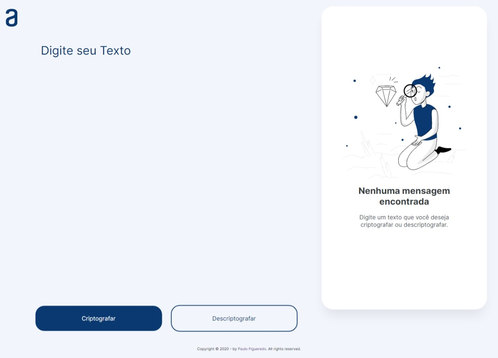

# Decodificador de Texto

## Desafio
- O desafio era desenvolver um decodificador que trocasse as vogais por codigos.

## Tecnologias
- As linguagens utilizadas foram HTML, CSS e JavaScript, o desing foi baseado no Figma desponibilizado pela Alura

## Screenshot

